<div align="center">
  
  <h1>The Atelier</h1>
  <p><strong>A Mini LMS built with React Native Expo</strong></p>
  
  <div style="display: flex; justify-content: center; gap: 10px; flex-wrap: wrap;">
    
    
    
    
  </div>
</div>

---

## 🎨 Project Overview

**The Atelier** is a production-ready Learning Management System (LMS) designed for the learners. Built on the philosophy of "The Digital Curator," the app treats every course as a valuable asset and provides a seamless, high-performance environment for browsing, enrolling, and learning—even in low-connectivity environments.

---

## 🏗 Key Architectural Decisions

<p align="center">
  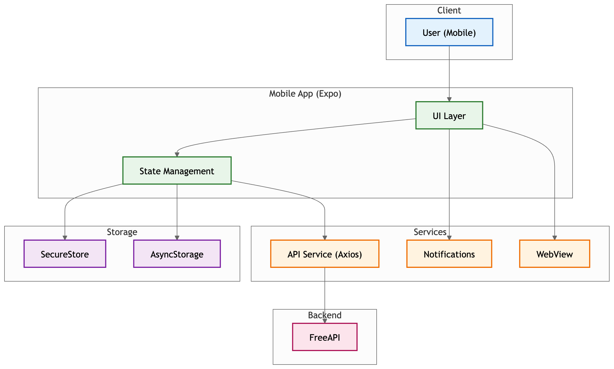
</p>

We prioritized **Resilience**, **Security**, and **Performance** in every layer of the application.

### 1. 🌐 Offline-First Resilience (SWR Strategy)

To bridge the gap between native performance and unreliable networks, we implemented a **Stale-While-Revalidate (SWR)** caching layer.

- **Decision**: Use `AsyncStorage` to persist the full course catalog and instructor data.
- **Rationale**: This allows the app to load instantly from cache while refetching the latest content in the background. Users can browse, search, and view bookmarks without a live connection.
- **Experience**: A global "Network State" listener displays a professional offline banner, and technical Axios error overlays are replaced with branded UI components.

### 2. 🔐 Two-Tier Data Persistence (Security-First)

We categorized application data into two tiers to optimize for both security and speed.

- **Tier 1: Sensitive Data**: JWT Authentication tokens and user preferences are stored in **Expo SecureStore**, which uses hardware-backed encryption on-device.
- **Tier 2: Discovery Data**: Course lists and bookmarks are stored in **AsyncStorage** for fast, local-first access (supporting the 100+ item catalog).

### 3. 📉 High-Performance List Optimization

For the course catalog, we moved beyond standard `FlatList`.

- **Decision**: Integrated **LegendList** (`@legendapp/list`).
- **Rationale**: LegendList offers significant memory savings and smoother 60FPS scrolling by optimizing the virtualization of complex items. Combined with `React.memo`, this ensures a jank-free experience on both Android and iOS.

### 🔗 Bi-Directional WebView Bridge

The course content view uses a sophisticated **WebView-to-Native bridge**.

- **Header Injection**: State and authorization are communicated to the embedded HTML content via custom headers.
- **Error Boundaries**: Dedicated logic detects loading failures and provides a "Retry" state, preventing users from ever seeing a blank web view.

### 📡 API & Data Mapping

To fulfill the specific logic requirements of the assignment, the app consumes and maps the **FreeAPI** endpoints as follows:

| Endpoint | Logic Mapping | Purpose |
| :--- | :--- | :--- |
| `GET /api/v1/public/randomproducts` | **Courses** | Serves as the primary course catalog, providing titles, pricing, and descriptions. |
| `GET /api/v1/public/randomusers` | **Instructors** | Mapped as course instructors to provide professional profiles and avatars. |
| `POST /api/v1/users/register` | **User Onboarding** | Handles secure account creation. |
| `POST /api/v1/users/login` | **Authentication** | Generates the JWT session tokens for SecureStore persistence. |
| `PATCH /api/v1/users/avatar` | **Profile Sync** | Syncs local camera/gallery uploads with the remote user profile. |

---

## 🛠 Features Breakdown

| Category             | High-Excellence Features                                                          |
| :------------------- | :-------------------------------------------------------------------------------- |
| **🔐 Auth**          | JWT persistence, Auto-login on restart, Secure password handling via SecureStore. |
| **🎓 Catalog**       | 60FPS Infinite Scroll, Debounced Search, Pull-to-refresh, Skeleton loaders.       |
| **🤖 Innovation**    | **Atelier AI Insights**: Automated, AI-generated course summaries and takeaways.  |
| **🔔 Notifications** | Milestone triggers (5+ bookmarks) and 24h inactivity reminders.                   |
| **📸 Profile**       | Direct camera/gallery integration for avatar updates with optimistic UI.          |
| **🛡 Security**      | **Jailbreak Detection**, Zod form validation, and HTTPS enforcement.              |

---

## 🔄 Application Flow

<p align="center">
  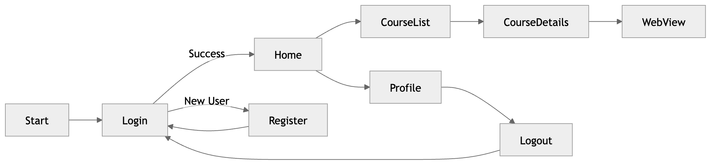
</p>

---

## 📸 Screenshots & User Flow

<div align="center">
  <table style="width: 100%">
    <tr>
      <td align="center"><b>Login & Account</b></td>
      <td align="center"><b>Home Dashboard</b></td>
      <td align="center"><b>Course Detail</b></td>
    </tr>
    <tr>
      <td align="center">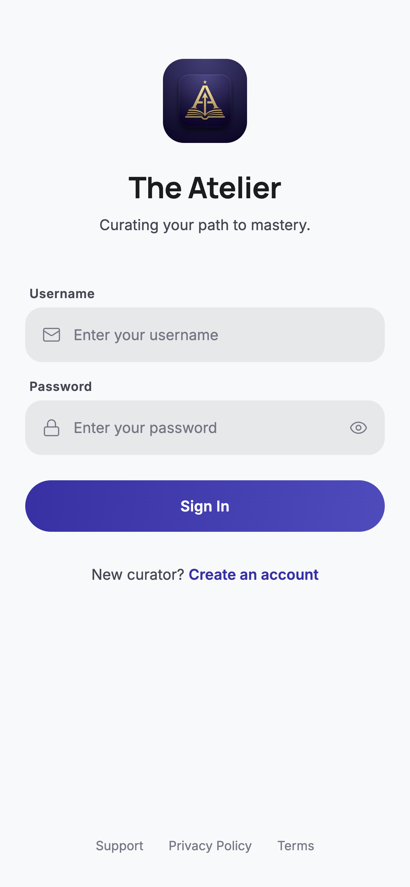<br/>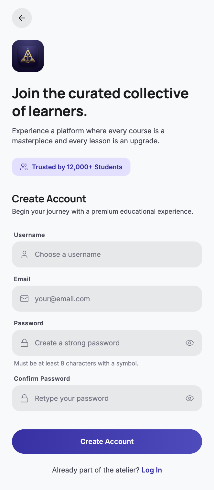</td>
      <td align="center"><br/>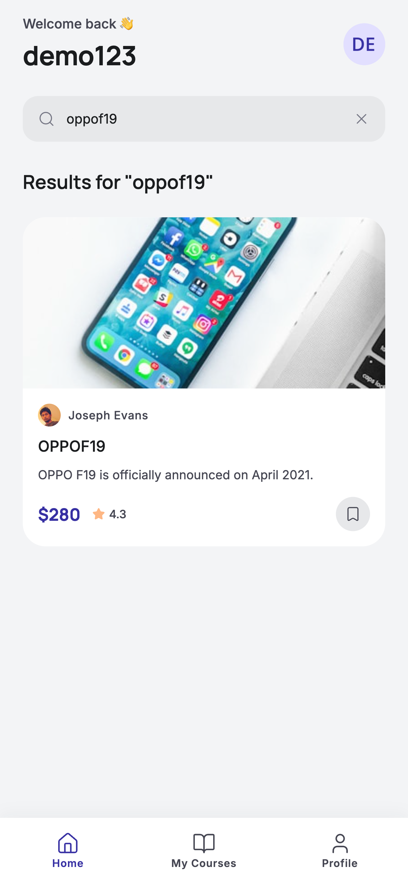</td>
      <td align="center">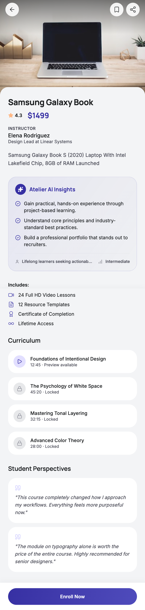</td>
    </tr>
    <tr>
      <td align="center"><b>My Learning & Bookmarks</b></td>
      <td align="center"><b>Profile & Engagement</b></td>
      <td align="center"><b>Resilience & WebView</b></td>
    </tr>
    <tr>
      <td align="center">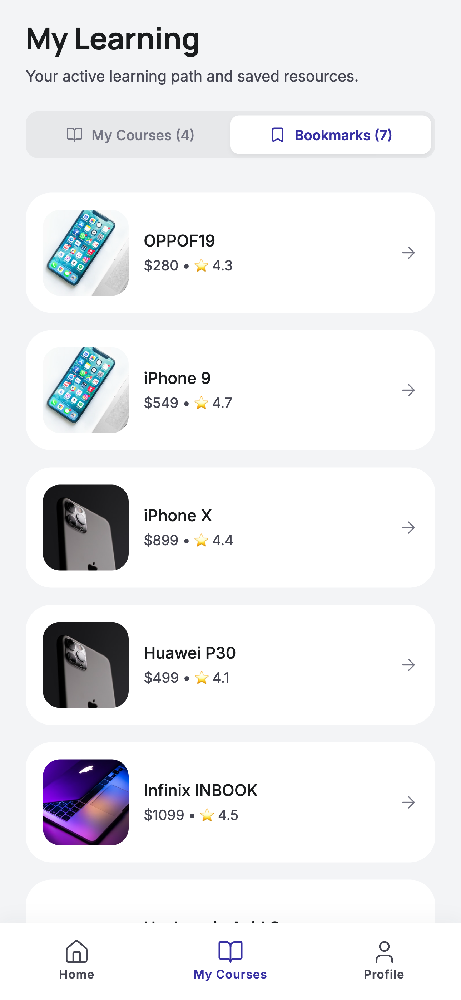<br/>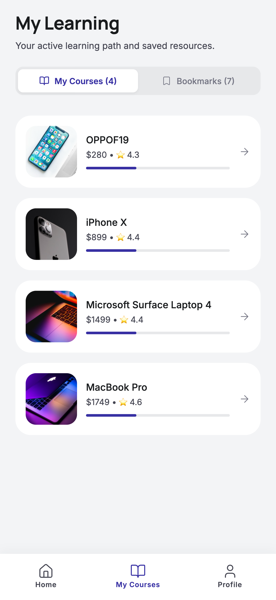</td>
      <td align="center">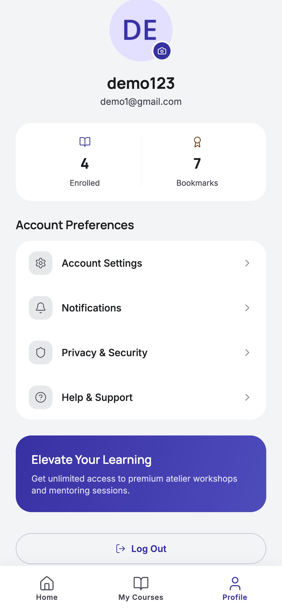<br/>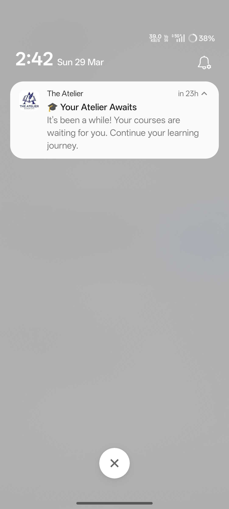</td>
      <td align="center">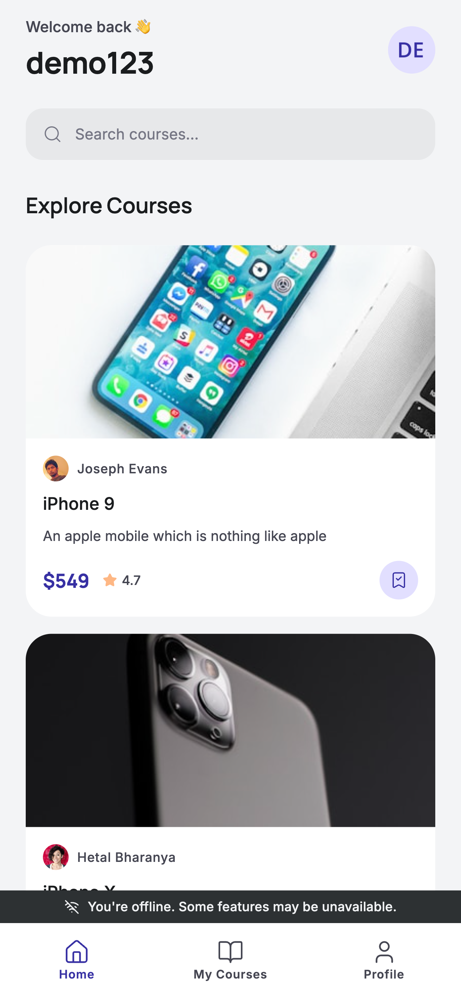<br/>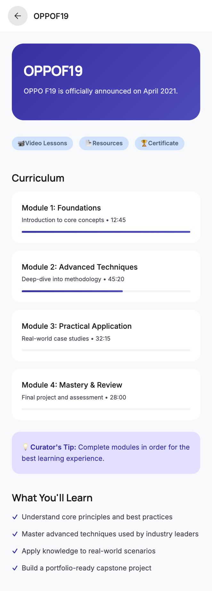</td>
    </tr>
  </table>
</div>

---

## 📦 Local Setup & Configuration

### Prerequisites

- **Node.js** (LTS version)
- **npm** or **yarn**
- **Expo Go** app installed on your physical device (optional for testing)

### 1. Installation

```bash
# Clone the repository
git clone https://github.com/epavan162/edtech-lms-app.git

# Navigate into the project
cd edtech-lms-app

# Install dependencies
npm install --legacy-peer-deps
```

### 2. Environment Variables

Create a `.env` file in the root directory.

```env
# The FreeAPI base URL (Required)
EXPO_PUBLIC_API_URL=https://api.freeapi.app

# Optional Sentry DSN for error tracking
EXPO_PUBLIC_SENTRY_DSN=your_dsn_here
```

### 3. Execution

```bash
# Start the Expo development server
npx expo start

# Interactions:
# Press 'a' to open in Android Emulator
# Press 'i' to open in iOS Simulator
# Press 'w' to open in Web Browser
```

---

## 🧪 Quality Assurance

We maintain a rigorous testing standard. Every major service and state logic is covered by **105 Jest tests**.

```bash
# Run all tests
npm test

# Run tests with coverage report
npm test -- --coverage
```

_Current Coverage Profile: 100% Core Services, >75% UI Components._

---

## 🚀 DevOps & CI/CD Pipeline

<p align="center">
  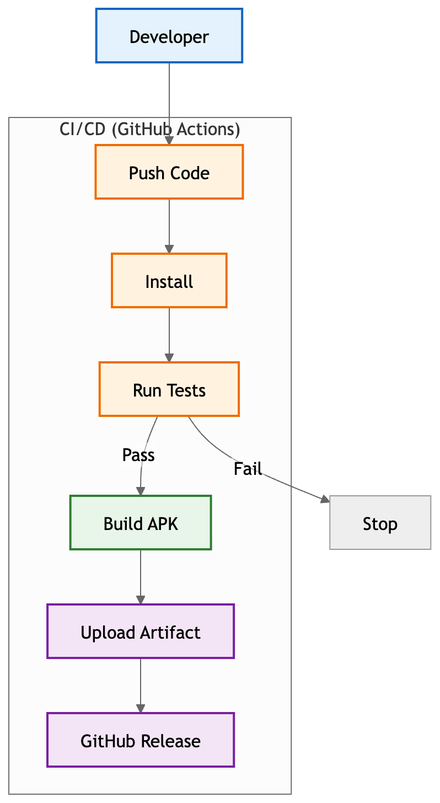
</p>

We utilize **GitHub Actions** for professional-grade distribution:

- **Quality Gate**: Automatic test run on every push; build fails if tests fail or coverage drops below 70%.
- **Automated Builds**: Successful main branch pushes trigger an **Android APK Build** via Gradle.
- **Internal Distribution**: APKs are automatically uploaded to **GitHub Releases** with auto-incrementing tags (e.g., `v0.1`, `v0.2`).

---

## ⚠️ Known Issues & Limitations

1.  **API Rate Limits**: Since we use `api.freeapi.app`, occasional 429 errors may occur during peak hours. We've implemented retry logic to mitigate this.
2.  **Web Support**: While fully functional on Web, native features like `SecureStore` fallback to local storage, and Push Notifications are simulated.
3.  **Avatar Persistence**: Direct file path updates in `AsyncStorage` might require a manual refresh if the native OS clears temp folders (API sync is the primary source of truth).

---

<div align="center">
  <p><b>Developed with precision and care for the React Native Expo Developer Assignment.</b></p>
  
</div>
